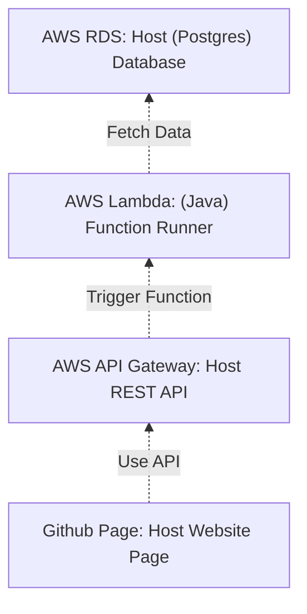

# CS425 Project

## Overview
Design a database system with GUI

## Process
<!-- 

-->

## Prerequisites
- Terminal
- Postgresql: Connect to AWS RDS
- Java
- Eclipse: Java editor (Optional)
- npm
- Vue
- Visual Studio Code: Vue editor (Optional)

## Steps
1. Generate Database in AWS RDS (See [cs425project_SQL](https://github.com/ppttzhu/cs425project/tree/master/cs425project_sql))
2. Run below script in terminal to connect to AWS RDS:
	`psql --host=cs425project.ck5idh9xvvie.us-east-1.rds.amazonaws.com --port=5432 --username=ppttzhu --password --dbname=cs425project`
3. Write Java code to fetch data from AWS RDS (See [cs425project_lambda](https://github.com/ppttzhu/cs425project/tree/master/cs425project_lambda))
4. Upload Java code to AWS Lambda (Visible with permission)
5. Add Lambda in AWS API Gateway as a resourse (Visible with permission)
6. Use Vue.axios to write GET/PUT method in API
	* Download code in current repo
	* `npm install`
	* `npm run serve`
	* `npm run build`
	*  See [Configuration Reference](https://cli.vuejs.org/config/) for detail
7. Sync code to github and create github page to host it
